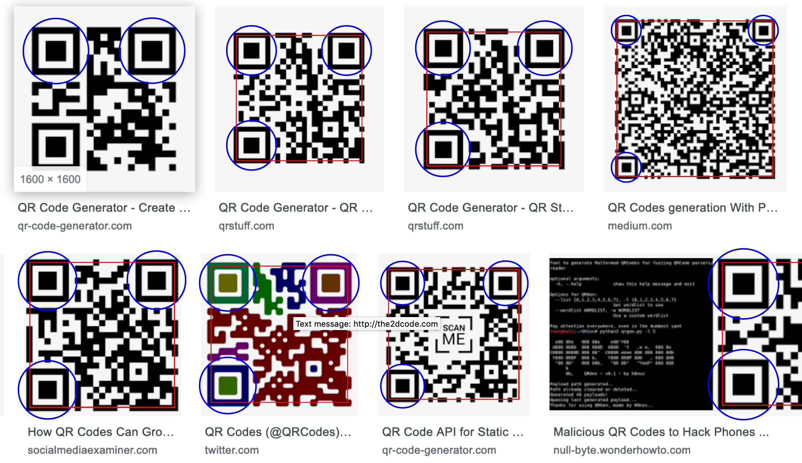

# qrcode - A QR code decoder written in C

*"What I cannot create, I do not understand."* - Richard Feynman

I always wondered how QR codes worked, so one day I decided to understand. This repository is the result of this learning process. It contains a
QR code decoder that, given a .png image as input, lists all the matches that were found. Except for the libpng library used to read the image, this implementation has no dependency. All the operations are implemented from scratch and explained with comments.

Being a learning project, this implementation does not try to be optimized or bullet proof. It does not support
rotated/distorted QR codes.


## How to build

Run ```make``` to build the ```libqrcode.so``` shared library as well as the example program ```qrcode``` that uses it to analyse
a given image and to present the results in the form of an html page.


## How to run

Run ```./qrcode image.png > example.html``` to analyze the given image and place the results in ```example.html```.
The html page shows the recognized finder patterns with blue circles and the decoded QR codes with red rectangles
that will show on hover the decoded message. Here is what such a page looks like:




The ```--verbose``` option is available for those for want details about the decoding process to
be emitted on the standard output:

```
$ ./qrcode -v images/QR_damaged.png > output.html
Found a potential code 29 x 29:
*******  * *   **  ** *******
*     *  **  * *  * * *     *
* *** *   *  *  ** ** * *** *
* *** * *    *** *    * *** *
* *** *    * ** * *   * *** *
*     * **  * * ***   *     *
******* * * * * * * * *******
        **  **** * **        
 **   *  **  ** **  * ** *   
 ** **  *** * *  *  * ** * **
   *  * ***     *   *  *  * *
*      ** *    *   *******   
******* ***     *   **** * * 
** *** * **   * * **  *  *  *
      *      *   ****  * ** *
   ***  ** * **   ***** **  *
**    *  * * ****** * **     
* * *  *  ****  * *  **  *  *
  ***** ** **** *  *    ** **
***  * * **** *** *****    * 
  * ***** * **  *  **** ** **
        **    ****  *   **   
*******   ******      * * *  
*     *  **  * * * *   * **  
* *** *  *** **  *    ***  * 
* *** *  *   **  *   *    * *
* *** * *   ****      *    * 
*     * **  * *      *  *    
*******  ****     **        *
Error correction level = QUARTILE
XOR mask pattern number = 1
QR version = 3

Applying error detection/correction to block 1/2...
17 data codewords:
4a 12 87 47 5f ec a2 f2 f5 ce e2 e6 d2 e7 76 e3 b6 

18 error detection/correction codewords:
1c b2 b6 67 95 96 00 39 d4 69 91 5a e8 da e1 91 dc 69 

Syndromes (d=17): a^4.X^17 + a^1.X^16 + a^118.X^15 + a^124.X^14 + a^32.X^13 + a^185.X^12 + a^83.X^11 + a^246.X^10 + a^77.X^9 + a^114.X^8 + a^196.X^7 + a^51.X^6 + a^99.X^5 + a^224.X^4 + a^24.X^3 + a^207.X^2 + a^53.X + a^180

sigma (d=7): a^196.X^7 + a^101.X^6 + a^1.X^5 + a^37.X^4 + a^100.X^3 + a^46.X^2 + a^126.X + 1

omega (d=6): a^125.X^6 + a^31.X^5 + a^223.X^4 + a^155.X^3 + a^188.X^2 + a^101.X + a^180

7 errors detected

Error are at bytes: 4 0 5 8 1 15 9
Correcting codeword #4 from 5f to 47
Correcting codeword #0 from 4a to 41
Correcting codeword #5 from ec to 03
Correcting codeword #8 from f5 to f6
Correcting codeword #1 from 12 to 96
Correcting codeword #15 from e3 to 96
Correcting codeword #9 from ce to 56

Byte sequence after error correction:
41 96 87 47 47 03 a2 f2 f6 56 e2 e6 d2 e7 76 96 b6 

Fixed 7 errors in block 1/2

Applying error detection/correction to block 2/2...
17 data codewords:
8c e6 56 62 b3 12 e6 f7 78 70 ec 11 ec 11 ec 91 ec 

18 error detection/correction codewords:
a8 a9 59 58 09 49 e7 9d 65 a9 ed b8 2b ed fe 23 0b e0 

Syndromes (d=17): a^87.X^17 + a^14.X^16 + a^29.X^15 + a^94.X^14 + a^224.X^13 + a^249.X^12 + a^190.X^11 + a^170.X^10 + a^200.X^9 + a^245.X^8 + a^140.X^7 + a^199.X^6 + a^212.X^5 + a^39.X^4 + a^238.X^3 + a^141.X^2 + a^172.X + a^225

sigma (d=6): a^173.X^6 + a^144.X^5 + a^220.X^4 + a^68.X^3 + a^37.X^2 + a^184.X + 1

omega (d=5): a^164.X^5 + a^182.X^4 + a^163.X^3 + a^158.X^2 + a^139.X + a^225

6 errors detected

Error are at bytes: 3 4 0 8 1 15
Correcting codeword #3 from 62 to 46
Correcting codeword #4 from b3 to 96
Correcting codeword #0 from 8c to 97
Correcting codeword #8 from 78 to 26
Correcting codeword #1 from e6 to 06
Correcting codeword #15 from 91 to 11

Byte sequence after error correction:
97 06 56 46 96 12 e6 f7 26 70 ec 11 ec 11 ec 11 ec 

Fixed 6 errors in block 2/2

All blocks successfully parsed into 34 bytes:
41 96 87 47 47 03 a2 f2 f6 56 e2 e6 d2 e7 76 96 b6 97 06 56 46 96 12 e6 f7 26 70 ec 11 ec 11 ec 
11 ec 

Decoding bytes...
Decoding binary segment of 25 bytes with ECI encoding ISO-8859-1
Decoded text message:
http://en.m.wikipedia.org
```


## Credits

This work used the followed sources:

* https://en.wikipedia.org/wiki/QR_code : general information about QR codes, to get started
* https://github.com/zxing/zxing : this is a very popular encoder+decoder project written in Java
    that supports many types of codes, not just QR codes. The image binarization and error correction
    are almost direct ports of zxing's implementation
* https://en.wikiversity.org/wiki/Reed%E2%80%93Solomon_codes_for_coders : a nice walkthrough of how QR
  codes work
* https://github.com/nurse/nkf : a Kanji converter used to implement the Shift JIS decoder
* https://encoding.spec.whatwg.org/ : the reference used to implement the Big5, EUC-KR and GB18030 decoders
* https://ftp.unicode.org/Public/MAPPINGS/ISO8859/ : the reference conversion tables for the ISO-8859-XX decoders
* https://www.unicode.org/Public/MAPPINGS/VENDORS/MICSFT/ : the reference conversion tables for the CPXXX decoders
